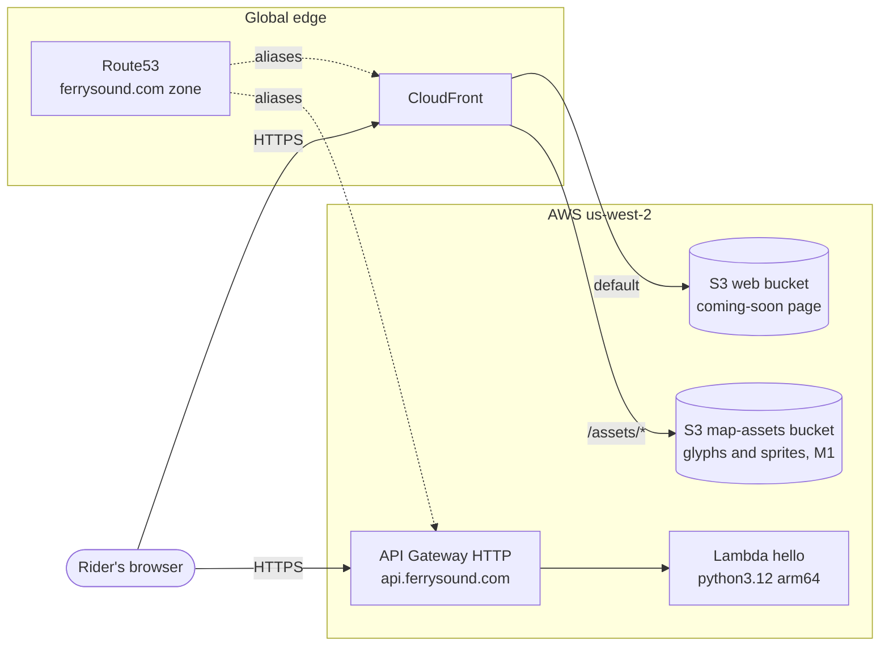

# Architecture

Living document - updated every time deployed infrastructure changes
(CLAUDE.md mandate). Decisions behind the shapes: [ADR-0001](adr/0001-architecture-cost-bakeoff.md)
(serverless lakehouse), [ADR-0003](adr/0003-tile-hosting.md) (tiles),
[ADR-0004](adr/0004-state-backend-and-ci.md) (state + CI).

## Deployed today (M0 walking skeleton)

Account-level (bootstrap stack): Terraform state bucket with native lockfile,
GitHub OIDC provider, plan/apply CI roles, $15 budget with three email
notifications.

## Deploy pipeline

Bootstrap is applied only locally by a human - CI never manages its own
credentials or state bucket.

## Target state (decided in ADR-0001, lands M1-M4)

## ERD

- **Source data ERD** (WSDOT API, as-is): `api-exploration-wsdot-ferries/report.html`, ERD tab.
- **Product data model ERD**: lands with M1's DynamoDB single-table design and
  Parquet schemas; will live here.
