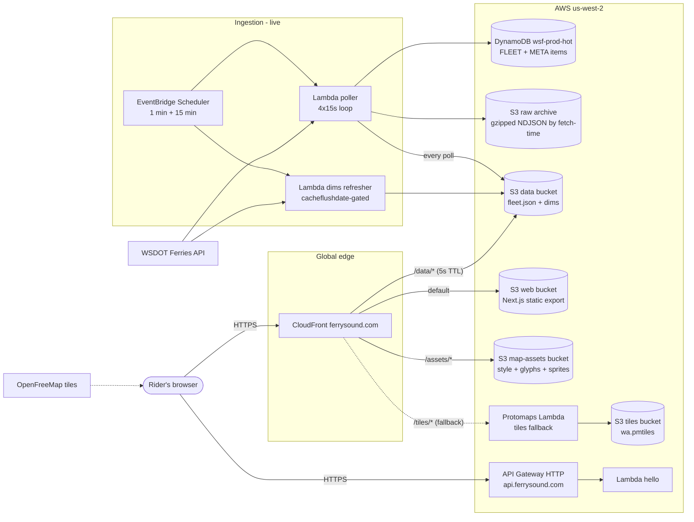
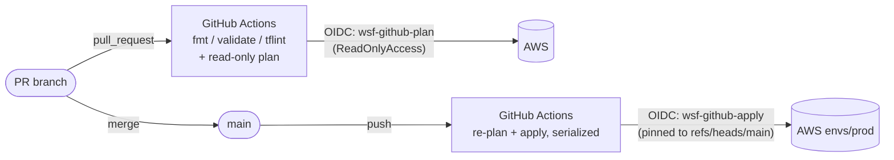
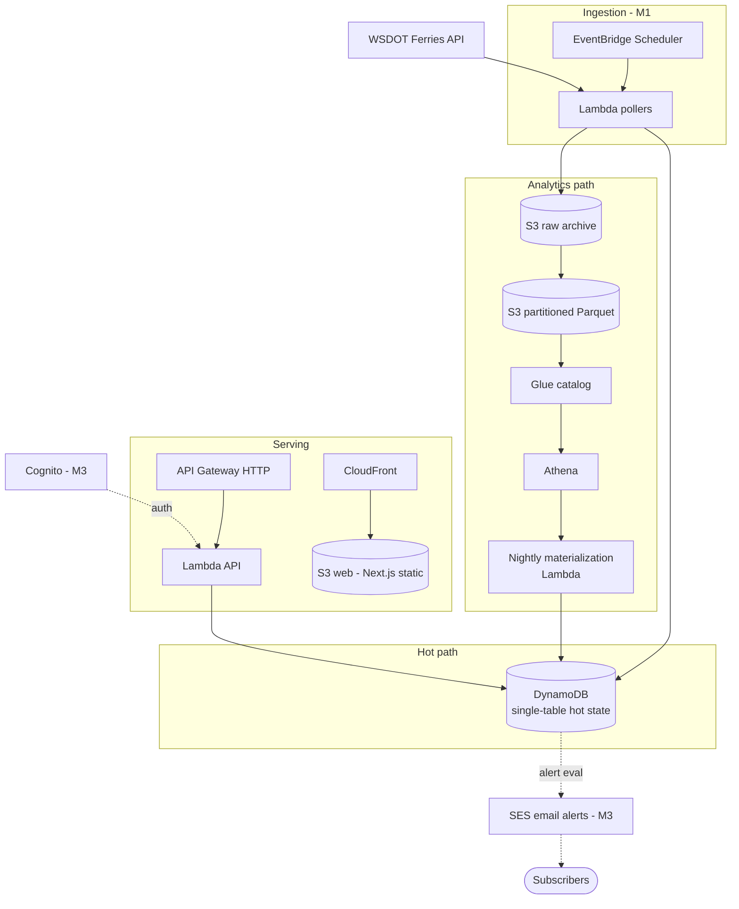

# Architecture

Living document - updated every time deployed infrastructure changes
(CLAUDE.md mandate). Decisions behind the shapes: [ADR-0001](adr/0001-architecture-cost-bakeoff.md)
(serverless lakehouse), [ADR-0003](adr/0003-tile-hosting.md) (tiles),
[ADR-0004](adr/0004-state-backend-and-ci.md) (state + CI).

## Deployed today (M0 skeleton + M1 data path + M1 web)

The web app (ferrysound.com): Next.js static export, MapLibre GL on the
forked positron style (self-hosted at `/assets/style/positron-v1.json`),
fleet polled from `/data/fleet.json` every ~12 s, four vessel states,
`/ambient` wall mode with wake lock + daily reload. Deploys via
`web-deploy.yml` two-pass sync + invalidation. Tiles come from the
OpenFreeMap public instance; the PMTiles fallback behind `/tiles/*` is the
tested escape hatch (ADR-0003 as amended).

Alarms: poller-gap (the SLO alarm), auth-failure (400+Message canary),
empty-fleet, two Lambda-error alarms - all to the `wsf-prod-alarms` SNS
topic. Account-level (bootstrap stack): Terraform state bucket with native
lockfile, GitHub OIDC provider, plan/apply CI roles, $15 budget with three
email notifications.

## Product data model (ERD start - grows with each milestone)

**DynamoDB `wsf-prod-hot`** (single table, generic PK/SK, on-demand):

| Item | PK | SK | Content |
|---|---|---|---|
| Fleet position (21) | `FLEET` | `VESSEL#0038` (zero-padded VesselID) | name, lat/lon/speed/heading (N), at_dock, in_service, state, terminals, eta/left/sched ISO strings, source_ts, fetched_at |
| Poll health | `META` | `POLLER#vessellocations` | last_success/attempt, polls ok/failed, last_error |
| Dim refresh tokens | `META` | `CACHEFLUSH#vessels\|terminals` | opaque cacheflushdate token |
| M2 departures (planned) | `PAIR#0007#0003` | `DEP#<iso>` | TTL via `expires_at` |
| M3 alerts (planned) | `ALERTS` / `USER#` | `BULLETIN#` / `SUB#<route>` | Streams fan-out |

**Public snapshot contract** (`/data/fleet.json`, versioned `"v": 1`, ADR-0005):
`generated_at` + per vessel `{id, name, lat, lon, speed, heading, state[underway|docked|yard|stale], insvc, age_s, dep, arr, left, eta, eta_basis, sched, routes, pos}`.
Dims: `/data/vessels.json` (class/capacity/years), `/data/terminals.json`
(20 real + synthetic Eagle Harbor 122).

**Raw archive** (`wsf-prod-raw-*`): `raw/<dataset>/dt=YYYY-MM-DD/HHMM.ndjson.gz`
partitioned by fetch-time UTC; the replayable ground truth for M4.

## Deploy pipeline

Bootstrap is applied only locally by a human - CI never manages its own
credentials or state bucket.

## Target state (decided in ADR-0001, lands M1-M4)

## ERD

- **Source data ERD** (WSDOT API, as-is): `api-exploration-wsdot-ferries/report.html`, ERD tab.
- **Product data model ERD**: lands with M1's DynamoDB single-table design and
  Parquet schemas; will live here.
