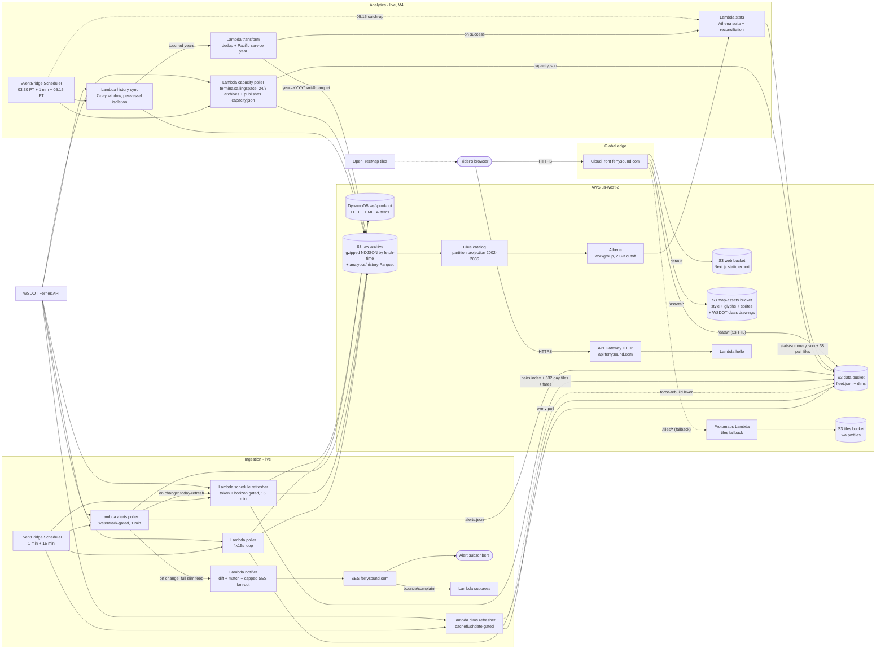
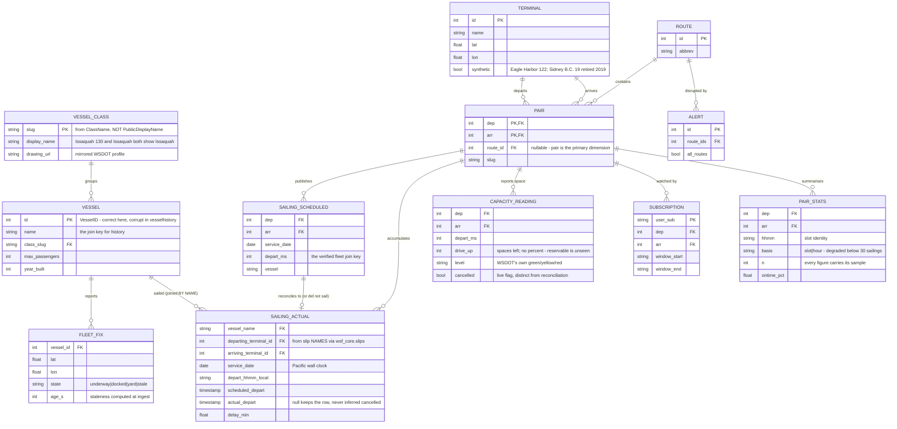

# Architecture

Living document - updated every time deployed infrastructure changes
(CLAUDE.md mandate). Decisions behind the shapes: [ADR-0001](adr/0001-architecture-cost-bakeoff.md)
(serverless lakehouse), [ADR-0003](adr/0003-tile-hosting.md) (tiles),
[ADR-0004](adr/0004-state-backend-and-ci.md) (state + CI).

## Deployed today (M0 skeleton + M1 map + M2 trip planner + M3 alerts + M4 analytics)

The web app (ferrysound.com): Next.js static export, MapLibre GL on the
forked positron style (self-hosted at `/assets/style/positron-v1.json`),
fleet polled from `/data/fleet.json` every ~12 s, four vessel states,
`/ambient` wall mode with wake lock + daily reload, and the M2 trip
planner: `/trip` picker + 38 pre-rendered pair pages joining the fleet
snapshot to pair-day files client-side (ADR-0005 - no API in the hot
path). Deploys via `web-deploy.yml` two-pass sync + invalidation. Tiles
come from the OpenFreeMap public instance; the PMTiles fallback behind
`/tiles/*` is the tested escape hatch (ADR-0003 as amended).

Alarms (16, all to the `wsf-prod-alarms` SNS topic). Ingest (8):
poller-gap (the SLO alarm), auth-failure (400+Message canary),
empty-fleet, three Lambda-error alarms, schedule-refresh-errors,
pairs-stale. Notify (1): notifier-errors. Analytics (7):
stats-not-fresh (the F4 freshness SLO - missing data breaches),
stats-data-lag, unmapped-slip, history-failures, empty-night, and
Lambda-error alarms for transform and stats. Six sit past the 10-alarm
free tier (~$0.60/mo) - accepted deliberately, because each detects a
failure whose signature is silence. Account-level
(bootstrap stack): Terraform state bucket with native lockfile, GitHub
OIDC provider, plan/apply CI roles, $15 budget with three email
notifications.

## Product data model (ERD start - grows with each milestone)

**DynamoDB `wsf-prod-hot`** (single table, generic PK/SK, on-demand):

| Item | PK | SK | Content |
|---|---|---|---|
| Fleet position (21) | `FLEET` | `VESSEL#0038` (zero-padded VesselID) | name, lat/lon/speed/heading (N), at_dock, in_service, state, terminals, eta/left/sched ISO strings, source_ts, fetched_at |
| Poll health | `META` | `POLLER#vessellocations` | last_success/attempt, polls ok/failed, last_error |
| Refresh tokens | `META` | `CACHEFLUSH#vessels\|terminals\|schedule\|fares` | opaque cacheflushdate token |
| Pairs horizon | `META` | `HORIZON#pairs` | last published horizon window |
| Alerts watermark | `META` | `ALERTS#watermark` | `maxid:maxms` change gate |
| Departures, today+tomorrow (M2) | `PAIR#0007#0003` | `DEP#<iso>` | vessel, depart_ms; TTL `expires_at` = depart + 6 h; M3's alert-evaluator Query substrate |
| Bulletin state (M3) | `ALERTS` | `BULLETIN#<id>` | first_seen_ms, text_hash, gone_at; notifier-owned diff state |
| Subscriptions (M3) | `USER#` + `ROUTE#<rid>` mirror | `SUB#...` | pair, window, email; TransactWrite pairs |
| Send claims / caps (M3) | `USER#` | `SENT#<bulletin>` / `NOTIF#<date>` | effectively-once + daily caps |
| Suppression (M3) | `EMAIL#<email>` | `SUPPRESS` / `USER` | complaint/bounce hygiene + email->user pointer |

**Public snapshot contract** (`/data/fleet.json`, versioned `"v": 1`, ADR-0005):
`generated_at` + per vessel `{id, name, lat, lon, speed, heading, state[underway|docked|yard|stale], insvc, age_s, dep, arr, left, eta, eta_basis, sched, routes, pos}`.
Dims: `/data/vessels.json` (class/capacity/years, plus `drawing` -> the
mirrored WSDOT class profile at `/assets/vessels/<class-slug>.png`),
`/data/terminals.json` (20 real + synthetic Eagle Harbor 122). The map
draws terminals from this dim, filtered to the pairs index's live network,
so a retired terminal (Sidney B.C.) stays in the record without appearing
on a map of where you can catch a boat today.

Class slugs come from `ClassName`, never `PublicDisplayName`: `Issaquah`
and `Issaquah 130` share a display name and have different drawings, so a
display-name key merges two classes.

The dims refresher is token-gated on `cacheflushdate`; `{"mode":
"force-rebuild"}` is the lever for shipping a CONTRACT change when
upstream has no reason to flush.

**M2 trip contracts** (all `"v": 1`, ADR-0005 extension; details in
[trip-planner.md](features/trip-planner.md)): `/data/pairs/index.json`
(38 pairs + horizon), `/data/pairs/{dep}-{arr}/{date}.json` (14-day
window, `depart_ms` = the verified fleet join key),
`/data/fares/{dep}-{arr}.json` (LineItemLookup-resolved),
`/data/alerts.json` (watermarked), `/data/adjustments.json` (season-wide
service calendar from timeadj). Pair-day files expire from the bucket
after 30 days.

**Raw archive** (`wsf-prod-raw-*`): `raw/<dataset>/dt=YYYY-MM-DD/HHMM.ndjson.gz`
partitioned by fetch-time UTC; the replayable ground truth for M4.

**M4 analytics store** (same bucket, `analytics/` prefix - derived, always
rebuildable from raw). Details and honesty rules in
[stats.md](features/stats.md).

`analytics/history/year=YYYY/part-0.parquet` - zstd, ONE file per year,
same-key overwrite (S3 PUTs are atomic and strongly consistent; a second
versioned file would double-count under partition projection). Year is the
**Pacific wall-clock service year**, so a 23:00 New Year's Eve sailing
belongs to the year the rider sailed it.

| Column | Type | Notes |
|---|---|---|
| `vessel_name` | string | the join key; VesselId in vesselhistory is corrupt |
| `departing_terminal_id` / `arriving_terminal_id` | int32 | via `wsf_core.slips`; the PRIMARY stats dimension |
| `route_id` | int32, nullable | best-effort annotation from the live pairs index |
| `service_date` | date32 | Pacific |
| `depart_hhmm_local` | string | Pacific; slot identity is (dep, arr, HH:MM) |
| `scheduled_depart` / `actual_depart` | timestamp ms | UTC-naive; null actual keeps the row with null delay |
| `delay_min` | float32 | actual - scheduled; negative means early |

No `cancelled` column: vesselhistory has no such flag, so the column could
only ever hold a hardcoded `false` published as fact. Cancellation is a
scheduled-vs-sailed reconciliation instead (`reconcile.py`, from
2026-07-29).

`analytics/quarantine/dt=.../HHMMSS.ndjson.gz` - rows that could not join,
with a reason. Current residue: 119,579 `null_slip` (2.95%, a COVID-era
cluster), **zero** `unmapped_slip`.

**Catalog**: Glue database `wsf_prod_analytics`, EXTERNAL_TABLE `history`,
partition projection `year` 2002-2035 (no crawler, no partition metadata to
drift). The location template must match the prefix byte for byte - a
mismatch returns zero rows silently. Athena workgroup
`wsf-prod-analytics` enforces the result location and a 2 GB scan cutoff.

**M4 stats contracts** (`"v": 1`): `/data/stats/summary.json` (system
windows, 24-year `by_year`, `by_month`, per-vessel table, superlatives,
coverage + thin days, cancellations) and `/data/stats/pairs/{dep}-{arr}.json`
(pair headline, `slots[]` with `basis`/`primary`/`slot_window`/`all_time`,
`seasons[]`, cancellations). Keyed by terminal ID so a rename never breaks a
file name. `/data/capacity.json` (minute-fresh, pair-keyed drive-up space +
`reporting_terminals`, so absence is distinguishable from fullness).

Scale as of 2026-07-30: **3,493,725 sailings, 2002-03-01 to 2026-07-30, 30
vessels, 25 partitions, ~46 MB Parquet**; a full nightly Athena suite scans
~237 MB (~$0.0012).

## Deploy pipeline

Bootstrap is applied only locally by a human - CI never manages its own
credentials or state bucket.

## Target state (decided in ADR-0001, lands M1-M4)

## ERD

**Source data ERD** (WSDOT API, as-is): `api-exploration-wsdot-ferries/report.html`, ERD tab.

**Product data model.** The logical entities, independent of where each is
stored (DynamoDB items, Parquet columns and published JSON all appear here;
the storage map follows the diagram).

Two joins in that diagram are the project's hard-won ones, and both are
documented where they are implemented rather than assumed:

- **SAILING_ACTUAL joins VESSEL by NAME**, because `vesselhistory`'s
  VesselId is corrupt. The feed also answers only to space-stripped names
  (`WallaWalla`), which is why `wsf_core.vessel_names` exists to put the
  space back for display.
- **SAILING_ACTUAL carries slip names, not terminal names** ("Colman" is
  Seattle). `wsf_core.slips` is the only join path, curated from a scan of
  all 4,058,477 backfilled rows.

**Where each entity lives**

| Entity | Store |
|---|---|
| VESSEL, VESSEL_CLASS, TERMINAL | `/data/vessels.json`, `/data/terminals.json` (dims, token-gated) |
| PAIR, ROUTE | `/data/pairs/index.json` |
| FLEET_FIX | DynamoDB `FLEET` items + `/data/fleet.json` |
| SAILING_SCHEDULED | `/data/pairs/{dep}-{arr}/{date}.json`, DynamoDB `PAIR#` items, archived in `raw/schedule_refresh/` |
| SAILING_ACTUAL | `analytics/history/year=YYYY/part-0.parquet` |
| PAIR_STATS | `/data/stats/pairs/{dep}-{arr}.json` + `/data/stats/summary.json` |
| CAPACITY_READING | `/data/capacity.json` (1 min) + `raw/terminalsailingspace/` |
| ALERT | `/data/alerts.json`, DynamoDB `ALERTS` items |
| SUBSCRIPTION | DynamoDB `USER#` + `ROUTE#` mirror items |
